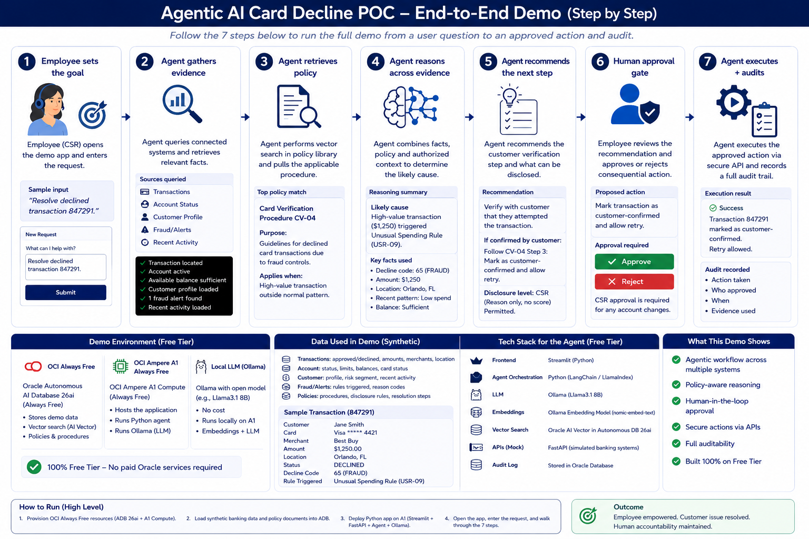
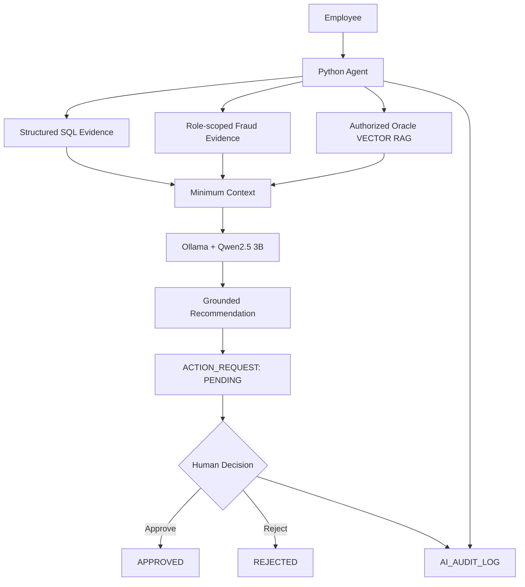

# Secure Agentic AI Banking Demo

**A public-safe enterprise AI proof of concept showing how agentic AI can increase employee capacity without removing human accountability.**

This project uses a synthetic declined-card scenario to demonstrate **Oracle AI Database vector search, Retrieval-Augmented Generation (RAG), Python orchestration, a local Large Language Model (LLM), role-aware authorization, human approval, and auditability**.

> **Portfolio note:** This repository contains fictional banking data and a sanitized reference implementation. It contains no real customer data, production credentials, Oracle wallet files, or employer/client source material.



## The scenario

A customer calls because a **$1,250 purchase is declined**. Instead of forcing a service representative to manually navigate transaction, account, fraud, and policy systems, the agent:

1. retrieves transaction and account facts;
2. retrieves only fraud fields allowed for the employee role;
3. performs role-filtered semantic retrieval over approved policy;
4. asks a local LLM to synthesize a grounded explanation and next step;
5. creates a **PENDING** action request; and
6. requires an explicit human decision before the workflow is complete.

Every material stage is recorded in Oracle for auditability.

## Why this demo is different from a basic RAG chatbot

The LLM is **not the authorization layer**.

```text
Employee role
    -> deterministic authorization
    -> permitted data and policy retrieval
    -> minimum context
    -> LLM reasoning
    -> PENDING action
    -> human approval / rejection
    -> audit
```

For the `CUSTOMER_SERVICE` role, restricted fraud fields such as `fraud_score` and `internal_notes` are never returned by the tool. Restricted policy rows are filtered before vector similarity results are returned. The model cannot disclose information it never receives.

## Architecture



## Technology

| Area | Implementation |
|---|---|
| Relational + vector data | Oracle AI Database |
| Vector type | `VECTOR(768, FLOAT32)` |
| Semantic similarity | `VECTOR_DISTANCE(..., COSINE)` |
| Embeddings | `nomic-embed-text` |
| Generation | `qwen2.5:3b` via Ollama |
| Orchestration | Python |
| Authorization | deterministic SQL/tool filtering before LLM context |
| Human control | separate `PENDING -> APPROVED/REJECTED` review step |
| Audit | `AI_AUDIT_LOG` in Oracle |

## Quick start

See [`docs/PUBLIC_BUILD_RUNBOOK.md`](docs/PUBLIC_BUILD_RUNBOOK.md) for setup.

For a configured environment:

```bash
source .venv/bin/activate

# Python reads local secrets from .env through python-dotenv.
# Do not commit .env.
python src/test_ollama.py
python src/test_db.py
python src/embed_policies.py
./scripts/reset_demo.sh
python src/bank_agent.py 847291
python src/review_action.py
```

## What a successful run proves

- structured SQL retrieval for deterministic facts
- embeddings and semantic vector search for policy
- Retrieval-Augmented Generation (RAG)
- explicit multi-step agent orchestration
- role-aware least-privilege context
- data minimization before LLM reasoning
- grounded recommendation generation
- human-in-the-loop approval
- independent audit events for AI and human decisions
- model portability: the governance design does not depend on one LLM provider

## Start here by audience

**Executive / hiring manager:** README -> workflow image -> `docs/supporting/Agentic_AI_Banking_Demo_Plain_Language_Deck.pptx`

**Enterprise architect:** `docs/Banking_Agent_Master_Guide.md` -> `SECURITY.md` -> decision-rationale guide

**Engineer:** `docs/PUBLIC_BUILD_RUNBOOK.md` -> `src/` -> `sql/` -> `scripts/reset_demo.sh`

**Interviewer:** `demo/demo-script.md` and `demo/interview-qa.md`

## Repository structure

```text
secure-agentic-ai-banking-demo/
├── README.md
├── SECURITY.md
├── LICENSE
├── .gitignore
├── .env.example
├── requirements.txt
├── src/
├── sql/
├── scripts/
├── demo/
├── architecture/
└── docs/
```

## Production boundary

This is a proof of concept, not a claim of production banking readiness. A production implementation would strengthen identity, private networking, secrets management, high availability, disaster recovery, model governance, observability/SIEM, authenticated action APIs, formal AI evaluation, adversarial testing, compliance controls, and change management.

See [`SECURITY.md`](SECURITY.md) and the Master Guide for the productionization roadmap.

## License

MIT. See [`LICENSE`](LICENSE).
