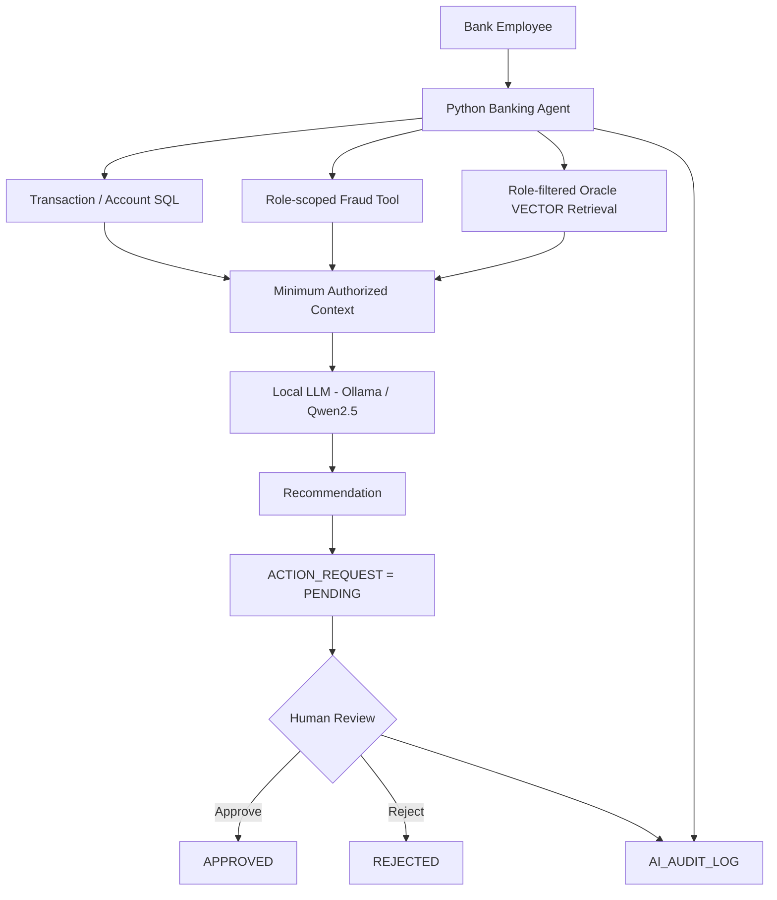
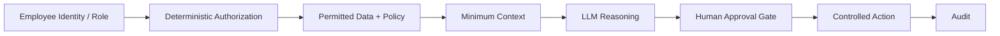

# Architecture

## End-to-end control flow

## Trust sequence

## Core design rule

**Retrieval relevance never overrides authorization.** The system first determines what the employee is permitted to retrieve; semantic similarity ranking is performed only within that permitted set.
